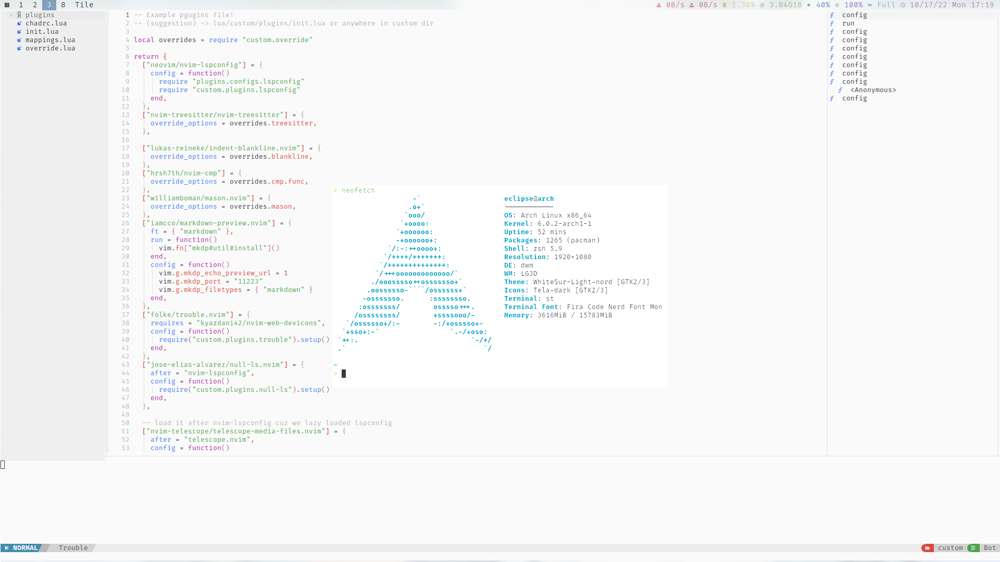

# My Own Dwm Config
---

### Dependencies
- Font
    - nerd-font-fira-code
- Launcher
    - rofi
    - dmenu
    - xmenu
- Terminal
    - alacritty
    - st
- Editor
    - neovim
    - vim
    - vscode
- Compositor
    - picom-jonaburg-git
- Shell
    - zsh
- PDF Reader
    - zathura
- Player: mpd, ncmpcpp
- Notification Daemon: dunst
- Wallpaper Setter: feh
- Screen Locker: betterlockscreen
- GTK Theme: 
    - Light: WhiteSur-White-nord
    - Dark: WhiteSur-Dark-nord
- Qt Theme:
    - use `qt5ct` and `qt5-styleplugins` to set qt theme follow gtk2 theme  
- Icon Theme: Tela
- status bar: [goblocks](./goblocks/)
- Screenshots: flameshot
  
---
### Usage
1. Clone this repo and backup your own config
2. Install dependencies mentioned above
3. Copy config files to corresponding directories
   
---
### Keybindings
You can find keybindings in [config.h](./config.h)

---

### Other
##### Theme Switcher
The simple script in .local/bin/ called switch can switch nord-light and nord-dark theme through a shortcut defined in dwm/config.h

##### Status Bar
I use [goblocks](./goblocks/) as my status bar. You can find the config file in config/goblocks/config.toml
You should build it yourself and put the binary file in .local/bin/

##### File Location
- scripts/: ~/.local/bin/
- config/: ~/.config/
- .nord: ~/.nord
- .onehalflight: ~/.onehalflight
- ./xinitrc: ~/.xinitrc
  
##### Screenshots

